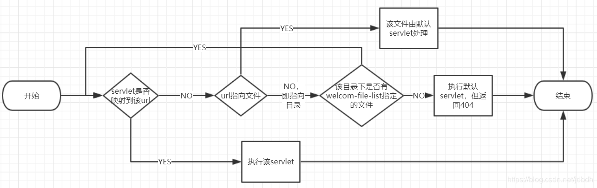

# SpringMVC工作流程

1. 浏览器发送请求，
2. 若请求地址符合前端控制器的url-pattern，该请求就会被前端控制器DispatcherServlet处理。
3. 前端控制器会读取SpringMVC的核心配置文件，通过扫描组件找到控制器，将请求地址和控制器中@RequestMapping注解的value属性值进行匹配，
4. 若匹配成功，该注解所标识的控制器方法就是处理请求的方法。处理请求的方法需要返回一个字符串类型的视图名称，
5. 该视图名称会被视图解析器解析，加上前缀和后缀组成视图的路径，
6. 通过Thymeleaf对视图进行渲染，最终转发到视图所对应页面
7. 